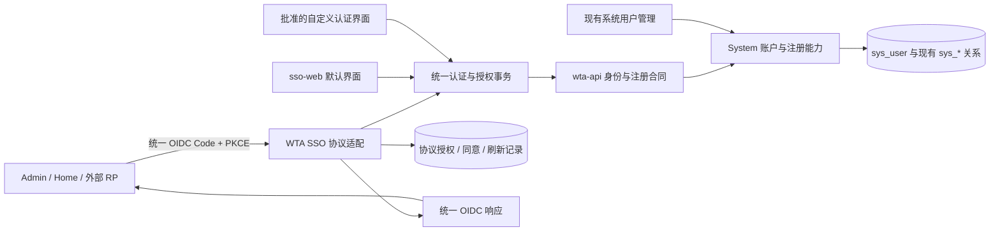

# WTA SSO 完整改造建议方案

**状态：推荐草案，尚未冻结。** 用户已确定的目标以本 change ADR 为准；本文件给出可审查的完整设计候选。Claude 参考全文缺失、设计树仍有高影响未决项，因此不能称为最终方案、Ready Spec 或已实现产品。

## 1. 产品边界

WTA SSO 面向内部 App 与外部平台提供同一 OIDC 授权服务器。所有接入方围绕同一 issuer、账户源、认证事务、授权码和令牌端点工作。Client 的注册属性决定保密能力、允许的回调、scope、登录域和同意策略，而非采用两套内外协议。

默认 sso-web 提供可直接使用的认证界面；App/第三方可以构建自定义界面。呈现方式的开放不等于任意调用者可选择身份、跳过账户验证或直接签发 token。

System 继续拥有用户、密码、资料、状态及用户管理。SSO 拥有协议、认证事务、中央会话、授权和同意；不新增账户库。业务权限仍由各业务 Client 与后端授权规则决定，登录成功不代表获得全部功能权限。

## 2. 架构与复用

建议优先评估与当前 Boot 4.1.0 BOM 对齐的 Spring Security 7.1 Authorization Server；不另起用户服务，不直接引入演示用内存用户或另一套客户端后台。框架负责标准协议，WTA 通过接缝接入账户、Client、权限与项目持久化。

框架选型必须先验证以下接缝再冻结：与 Sa-Token 的 Filter/MVC 拦截器共存；同一 OP 会话来源；opaque token 的 UserInfo；授权记录与账户状态的事务一致性；public-client refresh；签名密钥；项目 POST 安全审计。该调查是后续实现前的技术 Gate，不作为已经完成的验证。官方依据及版本限制见 <Path>{roots.state}/specdev/changes/2026-09-21-wta-sso-oidc-upgrade/evidence/protocol-research.md</Path>。

| Owner | 目标职责 | 应复用的现有落位 |
|---|---|---|
| wta-sso | OIDC 协议接入、授权事务、会话、token/consent 生命周期、协议持久化 | <Path>backend/wta-modules/wta-sso/</Path>；维持 layered 与 DAO 边界 |
| System | 用户、密码策略、登录域、Client 注册目录、用户/应用管理 | <Path>backend/wta-modules/wta-system/</Path>；保持 classic，不因本任务重写全模块 |
| wta-admin | 当前组装与身份桥接；复用现有注册用例 | <Path>backend/wta-admin/src/main/java/org/namewta/web/sso/</Path>；跨模块能力对外暴露最小接口 |
| wta-api | 身份查询/认证、统一注册、Client 认证/准入及失效通知合同 | <Path>backend/wta-api/src/main/java/org/namewta/sso/api/</Path>；兼容演进，不暴露 System Mapper/Entity |
| sso-web | 默认认证 UI 和错误恢复 | <Path>frontend/apps/sso-web/</Path> |
| shared auth | OIDC 消费抽象和 App 注入端口 | <Path>frontend/packages/platform/auth/</Path>；浏览器存储、导航和具体 OIDC 库放适配器 |
| Admin/Home | 入口、回调、业务会话建立、动态路由恢复 | <Path>frontend/apps/admin-web/</Path>、<Path>frontend/apps/home-web/</Path> |
| System Web | SSO 应用配置、用户管理与权限投影 | <Path>frontend/packages/domains/system/</Path>、<Path>frontend/packages/web-domains/system/</Path> |
| 发布 | 稳定 issuer、HTTPS、端点路由、三 App 配置与可重复验收 | <Path>release-artifacts/</Path> |

## 3. 统一流程

### 托管界面登录

1. Client 构造授权请求：`response_type=code`、`scope=openid …`、Client、精确 redirect、state、nonce、S256 challenge。客户端保存一次性事务关联，不能把 verifier 放到授权 URL。
2. 浏览器导航到 OP 授权端点。OP 校验 Client、回调及协议参数；非法 Client/回调不跳转到未受信地址。
3. OP 创建或恢复有过期时间的认证事务；缺少合格中央会话时展示 sso-web。已有会话也遵守 `prompt/max_age` 和用户/Client 当前有效状态。`prompt=none` 不出现任何登录或同意 UI，不满足条件返回标准错误；请求 `max_age` 时返回相应 `auth_time`，重新认证必须更新真实认证时间，不能仅靠重发 token 冒充。
4. sso-web 通过认证事务完成密码、验证码及必要的后续步骤；成功后轮换会话标识，防止 session fixation。
5. 检查目标 Client 准入与 scope，同意策略允许时收集授权决定；拒绝产生标准错误回调，不签发 code。
6. OP 返回一次性 code + state；Client 核验 state 并携带 verifier 换票；confidential 额外执行客户端认证。
7. Client 用固定可信 issuer/JWKS 验证 ID Token 的签名、算法、时间、iss、aud、适用 azp 和 nonce，再建立自身登录会话；ID Token 不能当业务 API token。
8. Admin/Home 保持 `getInfo → getRouters → navigation Store → manifest → addRoute → replace` 的失败关闭顺序，各自 Client 的业务令牌不能互用。

### 托管界面注册

注册始于经过验证的目标 Client 认证事务。由事务决定注册策略和登录域；UI 只提交用户资料与验证凭据，不提交任意 role、userType、管理域或受信标志。复用当前手机号要求、验证码、密码策略和规范化规则；修改这些要求属于显式产品决定。

在同一数据库事务内创建 sys_user 及最小必要关系；失败整体回滚，重复提交/并发受数据库唯一性约束。成功后进入同一个认证/授权事务：是否已足够建立会话由验证证据决定，不把“数据库插入成功”自动等同于已完成全部认证。最终仍通过 code + PKCE 登录目标 Client。

注册成功后，具备对应管理范围的管理员无需同步等待即可查询该 user_id，并使用原有用户管理功能。通过 SSO 注册不赋予后台管理权限，也不为每个外部 Client 创建另一条 sys_user。

### 已有统一账户接入新 Client

用户名/手机已存在时引导登录或账户恢复，不创建影子用户、不凭相同邮箱自动合并账户。认证成功但无目标登录域/准入时显示准确业务提示。开放 Client 是否允许用户自行建立普通准入关系由 D-007 决定；Admin 等受限 Client 不自动提权。共享账户与每个 Client 的业务授权始终分别判断。

### 自定义 UI

所有模式共用一套事务状态机：`created → authentication_required → authenticated → consent_required/authorized → code_issued → completed`，以及 `denied/expired/cancelled` 终态。终态不能重开，事务标识高熵、短期、受客户端/回调/PKCE/nonce/scope 和浏览器或经验证交互通道绑定。

| 模式 | UI 的自由度 | 凭据与会话边界 | 评审建议 |
|---|---|---|---|
| 默认 sso-web | 开箱即用 | 认证 Origin 内登录；host-only 中央 Cookie | 必须交付 |
| 定制 OP 界面 | 可独立开发页面/组件与品牌交互 | 构建产物经过审查并由受控认证 Origin 托管；不加载任意远程脚本 | 推荐默认开放；不是只允许改 logo |
| 自托管 headless 认证 UI | 页面或原生表单由接入方拥有 | 接入方会接触密码；需要明确批准的认证交互扩展、事务安全和会话完成流程 | D-005 待定，不能静默删减用户诉求，也不能默认所有 RP 获权 |

若选自托管模式：前后端须专门定义交互初始化、挑战、提交、取消、继续的请求/响应和错误；短期 transaction token 不是 Client secret，也不能单独证明用户身份。Origin 白名单限制浏览器来源，但不能作为服务器调用方身份认证。只凭公开 client_id 不能获得受信凭据采集资格；需要部署准入、受控服务端通道或等价可审计的信任安排。

自托管认证完成后，通过绑定原认证事务的一次性继续凭证导航回 OP，重新核验该浏览器的授权上下文并防止登录 CSRF/会话置换，再由 OP 自己建立/更新中央 Cookie，完成 code 回调。不得把 sid/token 放 URL；不依赖跨站 fetch 能设置或读取 SSO Cookie。不满足这些条件的原生直输密码模式不得冒充符合原生 OIDC 最佳实践。

即使 self-hosted 交互最终返回标准 OIDC code，前段凭据 API 仍是 WTA 扩展，需明确版本与支持范围。推荐原生应用通过系统浏览器/认证会话使用同一授权端点和 PKCE；原生 SDK、回调 scheme/app link 的范围在读完参考方案后确认。

## 4. 协议外部合同候选

建议为标准协议分配 `/sso/oidc/**`，与历史 `/sso/oauth2/**` JSON 合同显式区分。实际路径由协议引擎配置和发布清单统一导出，不能让各 App 自行拼接。issuer 固定为可公开访问的 HTTPS URI，不随 UI base path、LB 内部地址、Host/X-Forwarded-* 任意变化；多环境使用各自固定 issuer。

| 能力 | 推荐外部合同 | 关键要求 |
|---|---|---|
| 发现 | issuer 对应的 `/.well-known/openid-configuration` | metadata 与实际公开端点一致，只声明已实现能力 |
| JWKS | metadata 中 jwks_uri | 只公开公钥；固定算法策略、kid、轮换与缓存/旧 key 保留 |
| authorize | 浏览器 GET/协议要求的 POST | 标准导航/响应；精确回调；openid、state、nonce、S256；prompt/max_age 正确处理 |
| token | POST form-urlencoded | 标准 OAuth JSON，`access_token/token_type/expires_in`，openid 请求签名 ID Token；no-store；不套 R |
| UserInfo | 标准 Bearer GET/POST | sub 与 ID Token 一致；按已授权 scope/claims 最小返回；不输出密码、角色全集或内部管理字段 |
| refresh | token 端点 `grant_type=refresh_token` | 按登记能力签发、轮换、重用检测、撤销整个 family；不能扩大原 scope |
| revoke | 标准 POST | Client 认证/归属、安全幂等响应；同步相应授权和令牌生命周期 |
| introspection | 仅授权资源服务器可调用的标准 POST | 适用于 opaque access token；active、scope、client 与适用资源上下文明确 |
| RP 发起退出 | metadata 对应 end_session_endpoint | 验证 id_token_hint 或等价身份、post_logout_redirect_uri/state；避免开放跳转和 CSRF |
| back-channel logout | 按最终范围对登记 RP 通知 | 签名 logout token、sid/sub、幂等和有界重试；不能声称外部本地会话绝对即时清空 |
| UI 认证交互 | 单独版本化的事务 API | 明确其为 OP 交互合同；状态变更 POST，安全审计、CSRF、限流；不暴露任意签发接口 |

标准端点按 OAuth/OIDC 的 method、media type、错误和 HTTP 状态执行，不受业务 R 包装侵入。业务 CRUD 保持查询 GET、变更 POST、`@Log`。Controller 的敏感 POST 禁止记录原文；协议引擎由 Filter 处理的 token/revoke 等端点，必须在技术 Gate 确认项目安全审计与 API-005 的适用实现，不能以引入框架为由静默豁免。

未知 client、非法 redirect 应本地失败；已验证 redirect 上的拒绝可以返回标准 `access_denied` 等协议错误。敏感响应和 Token 端点使用 no-store，日志只留安全事件与关联号；外部错误不泄露账号是否存在和底层异常。

## 5. 令牌、身份与会话

ID Token 是签名认证断言，aud 指向接收 Client；access token 用于相应受保护资源，不能因为 Client 匹配就自动拥有全部 WTA API 权限。外部 RP 建立自己的业务会话，仍以 WTA 作为登录身份来源。

`sub` 必须稳定、不可复用、不因用户名/邮箱/密码改变而变化；内部关联仍是 sys_user.user_id。public subject 或 pairwise subject 的隐私取舍在最终合同中明确；如需要 subject 映射，它是协议标识映射而非第二套账户。仅有邮箱/手机号值不能声明 `email_verified/phone_number_verified=true`。

| 方案 | 复用程度与代价 | 冻结条件 |
|---|---|---|
| A：保留 Sa-Token 作为 opaque access token | 延续既有 ADR 和 App token 形态；必须补唯一授权记录、UserInfo、introspection、scope/resource 与撤销一致性 | 技术 Gate 证明身份用途 token 不能访问未授权 WTA 业务 API，且 refresh/会话失效无双源分叉 |
| B：统一标准 OIDC token + WTA RP 业务会话适配 | 所有 RP 使用同一 OIDC token；Admin/Home 在验证 OP 身份后建立本地 Sa-Token 业务会话 | 显式演进旧 ADR，说明兼容和额外会话桥接成本；不让内部拥有另一个认证协议 |

D-006 决定目标资源范围；优先验证 A 的安全可行性，失败时必须重新决定 B，不在实现中悄悄切换。禁止把 OP Cookie、ID Token、其他 Client token 或身份用途 access token 当作任意 WTA API 凭证。

public browser/native 的 refresh 不能写成框架默认支持。Security 7.1.0 默认不向 authorization_code + none client 签发 refresh token；若要求该能力，需有受控扩展及真实并发重放验收，或明确采用 confidential BFF。不能为了 refresh 在浏览器分发 Client secret。

refresh 与离线访问授权不是同义词。若支持 `offline_access`，必须满足相应同意条件并明确授权期限；不能因 `autoConsent=true` 默认获得无限离线访问。标准依据：<Url>https://openid.net/specs/openid-connect-core-1_0.html#OfflineAccess</Url>。

建议建立账户安全版本和 Client 策略版本或等价机制：禁用、删除、重置密码、撤销登录域、撤销授权、停用/删除 Client 应使后续认证/换票/刷新立即失败或在明确的短窗口内失败。数据库状态是最终依据；缓存失效和通知需重试或回源兜底。

已签发 JWT 不因数据库改值而自动消失。ID Token 的有效期是认证断言时效，不是“用户尚未被停用”的在线证明。外部资源/RP 的会话失效必须依赖短期票据、在线校验或 logout 通知合同；具体时效进入 D-008，不写无法保证的“全平台瞬时注销”。

## 6. Client 管理与权限

沿用现有独立 SSO 管理与客户端接入两种管理页面，底层均映射 sys_client；避免再建立一套并行应用目录。

管理面明确展示：应用归属、public/confidential、认证方法、允许的回调和退出回调、scope、同意策略、注册策略、登录域、自定义 UI 模式、允许的浏览器 Origin、状态与凭据轮换。public 不显示有保密意义的 secret；confidential 的 secret 单次交付且服务端安全保存。

“获取配置”至少提供 issuer/discovery、client_id、认证方法、精确回调、PKCE 要求、scopes、示例及退出能力。外部应用只需要身份登录时默认最小 openid；profile、email、phone 等按实际需要申请和授权；WTA 资源权限必须单独批准。无需开放匿名动态客户端注册，若参考方案要求再评审其 owner 与防滥用。

客户端与用户 ID 保持既有语义：OAuth 字符串 client_id/clientid 与 sys_client.id/clientPk 不可互换。RBAC、菜单、登录域和会话不因协议统一而放宽；超级管理员也不跨 Client 使用 token。

## 7. 数据与兼容

保留 sys_user、sys_client、现有登录域与关系，不引入 sso_user。新增数据仅限当前缺失的协议对象，例如认证/授权记录、consent、refresh family、subject 映射、失效索引或密钥引用；具体字段按最终引擎和合同决定，避免先建一批用不到的表。

所有自有 DDL 只修改 <Path>release-artifacts/docker/infrastructure/mysql/init/10-cde-base-ddl.sql</Path>，初始化数据/菜单只修改 <Path>release-artifacts/docker/infrastructure/mysql/init/50-cde-base-dml.sql</Path>，遵循项目字段/中文注释/MyBatis 基类规则。现有环境以源/目标版本差异升级，不重放完整基座。

上线前做用户名/手机号/邮箱/Client 标识重复检查；历史冲突由明确迁移策略处理，不删除或自动合并用户。用户名大小写和 soft-delete 后重用不能由数据库默认 collation 偶然决定。新注册失败要给出可恢复提示。

兼容建议：先以独立标准端点扩展，再迁移 Admin/Home 和登记消费者。旧 JSON endpoints 如需保留，仅作同一新核心的限期兼容适配；登记使用者与关闭条件，不无限保留两个认证实现。已有本地登录可在明确 `local/both` 策略下兼容，`sso` 模式必须后端强制；新自定义 UI 不能把旧 `/auth/login` 当新的统一 OIDC 主流程。

会话 schema、issuer、密钥或 token 语义改变时要明确是否要求重新登录；回滚不能恢复已撤销密码、复活旧 refresh family 或向旧代码暴露无法理解的授权数据。并行版本兼容不成立时，采用明确的同版停流切换，而非宣称无损滚动升级。

## 8. 三 App 与发布

sso-web 目标页面：登录、注册、验证/挑战、密码找回与重置、同意/拒绝、账号切换、退出确认、事务过期/取消/错误恢复。注册开关、必填字段和挑战由后端策略驱动，前端不拥有授权。找回密码不能只凭知道手机号重置，必须完成既有验证能力或明确补足其后端合同。

Admin/Home 保留已有第三方区域第一位 WTA SSO；点击后进入统一 OP。完善回调错误和原业务路由恢复；Token 验证完成前不缓存成功状态，不残留 URL code。登录组件根据模式展示入口，SSO 可用性不耦合本地验证码。

推荐保持目前后端组装和独立 SSO HTTPS Origin，是否独立 Java 进程由 D-009 决定。独立进程不能直接读取 System Mapper 或另建用户库，需要明确公开身份服务及故障/时延合同，不能只从 POM 拆出进程就宣称解耦。

发布清单同步 issuer、discovery/JWKS 路由、端点 CORS、三 App Origin/base、callbacks、post-logout callbacks、Cookie、签名 key 引用和配置快照。签名私钥不进前端、源码、日志或公开 manifest；生产密钥持久化并设计轮换窗口。应用每次启动临时生成 RSA key 不可作为生产方案。

当前 release-origin fixture 的真实 Nginx/Cookie 验收保留；再新增真实 System 注册、业务 token 和外部 RP 的整套验证。生产回调不得使用种子里的 localhost 占位值。

## 9. 建议实施切片与完成门

以下是后续 S/T 的输入候选，不是已 Ready 的 Ticket，也不自动授权实现。

| 顺序 | 完整切片 | 必须交付的可见结果 |
|---|---|---|
| V0 | 参考全文对照、G 决策与协议内核接缝验证 | 高影响选择有结论，框架版本/会话/令牌/审计方案可实施 |
| V1 | 标准 OP + sys_client 管理合同 | 一个标准外部 RP 可以发现配置并完成登录；public/confidential 认证真实有效 |
| V2 | 统一账户注册与管理失效 | sso-web 注册同一个 sys_user，后台可管理；改密/停用/删除影响认证和会话 |
| V3 | 默认与选定自定义 UI | 同一认证事务完成登录、注册、拒绝、挑战及恢复，不旁路权限 |
| V4 | Admin/Home 完整 OIDC 接入 | 复用第三方入口、两端回调/会话/菜单恢复和 Client 隔离 |
| V5 | 同意、refresh、撤销、退出及开发者交付 | 最终范围中的生命周期通过；配置与外部 public/confidential 示例可复现 |
| V6 | 新建/存量升级、真实端到端与同版发布 | 所有验收证据、迁移/恢复演练、构建和发布合同闭合 |

每个切片同时覆盖后端、前端/消费者、权限、数据及失败路径；不以“后端接口写好了”宣称完整交付。后续 Skill 路由：engineering-standards、namewta-fullstack-development、wta-module-guide；触及公开 Java 合同加载 java-api-compatibility，涉及发布部署时另读 deploy-namewta-environment。

## 10. 当前未决与恢复

先取得并保存 Claude artifact 完整正文，再形成逐条对照；随后仅就正文仍未回答的问题完成设计树 D-005～D-009。当前可询问的 frontier 为 D-005、D-006、D-008、D-009，D-007 等 D-006 的资源/准入边界确定后再问。

取得答案后逐项写 LOG，更新设计树和必要 ADR/CONTEXT，回读并运行 grill 校验。所有高影响决定关闭且用户明确共识后，交接 <Path>{roots.workflows}/specdev/S-spec/S-spec.md</Path>。本轮不自动跳过 G 完成门，不把推荐草案写为最终承诺。
